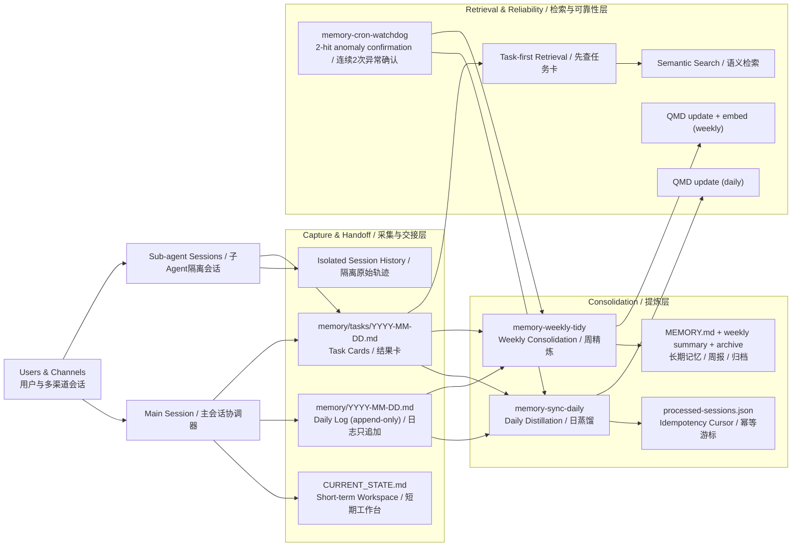

# Architecture

## 0) System Diagram

## 1) Design goals

- Reliability: memory tasks should self-heal and avoid silent failure
- Idempotency: no duplicate daily memory blocks for same conversation state
- Cost control: avoid unnecessary vector embedding
- Auditability: every decision and status can be traced

## 2) Pipeline

### Short-term Workspace (CURRENT_STATE)
- Keep `memory/CURRENT_STATE.md` as the active workbench for today.
- This file is the first rescue point after compaction/context reset.
- It can be overwritten each heartbeat/check cycle (unlike append-only logs).
- Recommended fields: `today goals / in-progress / blockers / next <=3`.

### Multi-agent memory model (main + sub-agents)
- Each agent/session keeps independent runtime context; cross-agent continuity should be file-based.
- Main session is the memory curator: it consolidates durable outcomes and decisions.
- Sub-agents focus on execution; their raw process remains in isolated session history for auditability.
- Shared handoff layer is `memory/tasks/YYYY-MM-DD.md` (result-only task cards).

### Task Memory Index (for sub-agents)
- Main session writes result-oriented task cards to `memory/tasks/YYYY-MM-DD.md`.
- Retrieval order should be: task cards first, then semantic memory search, then raw session drill-down.
- This preserves traceability while avoiding high-token replay of noisy execution logs.
- Recommended card fields: `goal / boundary / acceptance / key actions / artifact paths / final status / next step`.

### A. Daily Sync (`memory-sync-daily`)
- Schedule: `0 23 * * *` (local timezone)
- Scope: recent 26 hours of sessions
- Filter: skip sessions with `<2` user messages
- Write target: `memory/YYYY-MM-DD.md` (append-only for today)
- Idempotency key: message fingerprint from last user message
- Write discipline: daily logs are append-only; knowledge files should follow read-before-write checks

### B. Weekly Tidy (`memory-weekly-tidy`)
- Schedule: `0 22 * * 0`
- Consolidates recent 7-day daily logs into long-term memory
- Enforces `MEMORY.md` constraints (recommended hard cap: 80 lines / 5KB)
- Writes weekly summary: `memory/weekly/YYYY-MM-DD.md` (Monday key)
- Archives covered daily logs: `memory/archive/YYYY/`

### C. Watchdog (`memory-cron-watchdog`)
- Schedule: `15 */2 * * *`
- Detects disabled/stale/error states
- Suppresses transient noise: requires `2` consecutive anomalies
- Adds `last3` snapshots for diagnostics in alerts

## 3) State files

- `memory/state/processed-sessions.json`
  - stores per-session last fingerprint and timestamps
- `memory/state/memory-watchdog-state.json`
  - stores anomaly counters and `last3` snapshots
- `memory/tasks/YYYY-MM-DD.md`
  - stores result-only task cards for sub-agent jobs (goal/boundary/acceptance/actions/artifacts/status/next)
- `memory/CURRENT_STATE.md`
  - short-term workbench for main session; first read target after compaction/reset
- `memory/INDEX.md`
  - navigation entry for long-term/daily/task/state/archive paths

## 4) QMD strategy

- Daily: `qmd update`
- Weekly: `qmd update && qmd embed`

This keeps retrieval fresh while reducing embedding cost.

## 5) Why this design reduces token cost

- Daily sync runs once per day (instead of high-frequency re-summarization).
- Weekly tidy batches heavy consolidation and embedding.
- Fingerprint idempotency prevents duplicate memory writes.
- Task cards capture sub-agent outcomes without replaying full execution traces.
- Watchdog suppresses noisy one-off anomalies (2-hit confirmation).
